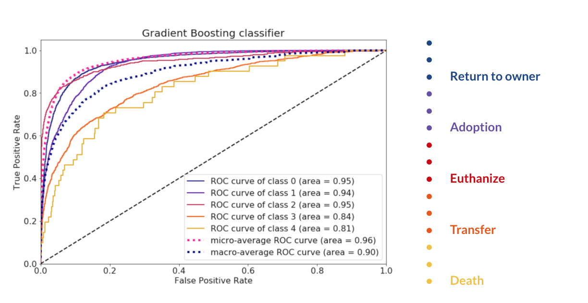
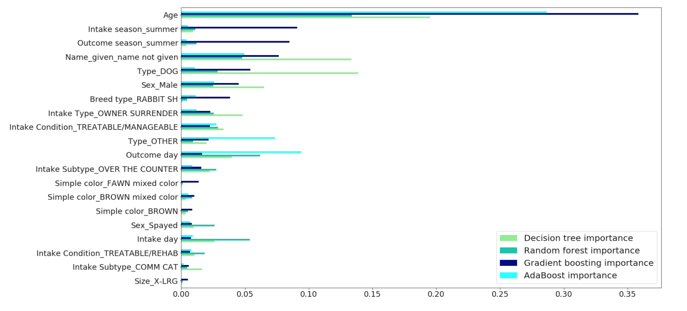

# Shelter outcomes classification    

The process of building prediction models from the raw data of an animal shelter, which aim to predict the trends in animal outcomes. By using the model, shelters are able to focus on those animals who need more help to get adopted. 

## Exploratory data analysis

For the EDA, I explored the most important variables and examined thier posssible relation to the prediction process. 

## Modeling

The baseline accuracy is 44%.

I tried out several algorithm to find the one that predicts best the outcomes, I mostly focused on the ensemble methods like Decision trees, Random Forest, AdaBoost and Gradient Boosting but I also tried Logistic regression to compare. After evaluating the models Gradient Boosting with the help of tuning, proved to be an effective way to enhance the accuracy and represent an 80% accuracy score for the classification. The evaluation of the best model can be seen below.

Finally I plotted the feature importances by all the models in the order of the Gradient Boosting model.

